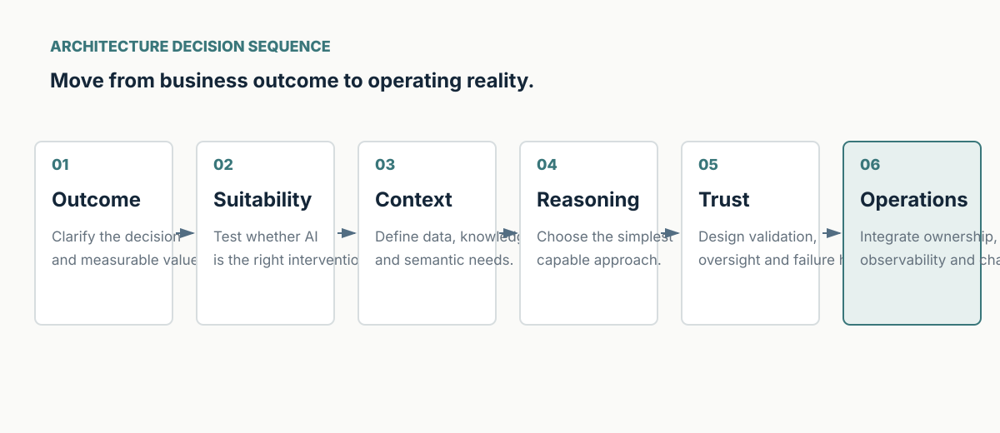

# Enterprise AI Architecture

A public, vendor-neutral set of architecture decision tools for moving from **business outcome** to **operable Enterprise AI capability**.

This repository is intentionally not a catalogue of AI tools. It focuses on the decisions that remain important as models and frameworks change: system boundaries, enterprise context, trust, integration, operating ownership and adoption.

## Core artifact — Enterprise AI Architecture Decision Canvas

Use the canvas before committing to a model, framework or deployment pattern.

1. **Business objective** — Which decision, workflow or outcome should improve?
2. **AI suitability** — Is AI actually the right intervention?
3. **Data & knowledge** — What information, semantics, provenance and constraints are required?
4. **Reasoning** — What is the simplest capable reasoning approach?
5. **Integration** — Where do system boundaries and responsibilities sit?
6. **Trust & governance** — What can fail, how is it validated, and who remains accountable?
7. **Evaluation** — How will technical quality and business usefulness be evidenced?
8. **Operability** — Who owns runtime behavior, observability, change and incident response?
9. **Cost & economics** — Which costs scale with use, complexity and assurance?
10. **Build vs buy** — Which capabilities are differentiating and which are commodity?
11. **Human oversight** — Where must a person review, approve or override?
12. **Change & adoption** — How will the capability fit real workflow and evolve safely?

## Repository structure

- `docs/architecture-principles.md` — durable architecture principles.
- `docs/decision-framework.md` — decision sequence and review questions.
- `templates/architecture-decision-canvas.md` — reusable canvas template.
- `templates/adr-template.md` — architecture decision record template.
- `examples/synthetic-case-study.md` — a synthetic enterprise case study.
- `examples/adr-001-context-strategy.md` — sample ADR.
- `diagrams/decision-canvas.svg` — editable vector diagram.

## How to use

Start with the business decision. Complete the canvas with the business owner, architecture/engineering representatives and risk/governance partners. Use ADRs for decisions that materially affect system boundaries, trust, cost or long-term changeability.

## Design philosophy

- Architecture before tool choice.
- Evidence before autonomy.
- Explicit context before prompt complexity.
- Trust by design, not as a final gate.
- Prefer the simplest capable system.
- Reuse principles and interfaces; avoid accidental platform-building.
- Treat adoption and ownership as architecture concerns.

## Public-safety note

All examples are synthetic and vendor-neutral. This repository contains no employer-confidential architecture, code, data, security mechanisms or roadmaps.

## License

MIT — see `LICENSE`.
