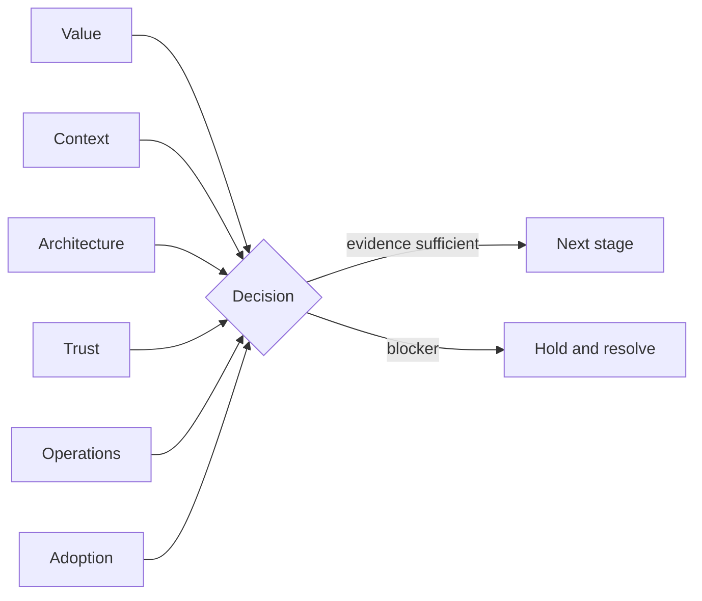

# Enterprise AI Architecture Decision System

[](https://github.com/abhi07gupta/enterprise-ai-architecture/actions/workflows/quality.yml)
[](LICENSE)

An evidence-led decision canvas and executable quality gate for reviewing an
enterprise or product AI initiative before it advances.

The toolkit documents six decisions that determine whether an initiative is
ready to progress: value, context, architecture, trust, operations, and
adoption. It is vendor-neutral and keeps evidence and decision authority
visible throughout the review.

## What is included

- a seven-part Enterprise AI Decision Canvas;
- deterministic validation of required decision evidence;
- a readiness assessment across value, context, architecture, trust,
  operations, and adoption;
- controls that prevent high-consequence initiatives from silently scaling;
- synthetic worked examples, review guidance, tests, and CI;
- a zero-runtime-dependency Python CLI.



## Quick start

```bash
python -m venv .venv
source .venv/bin/activate
python -m pip install -e .
eai-check examples/service_knowledge_copilot.json
```

The same command can run without installation:

```bash
PYTHONPATH=src python -m enterprise_ai_architecture.cli examples/service_knowledge_copilot.json
```

Example output:

```json
{
  "blockers": [],
  "decision": "pilot",
  "dimension_scores": {
    "adoption": 100,
    "architecture": 100,
    "context": 100,
    "operations": 100,
    "trust": 100,
    "value": 100
  },
  "next_actions": [],
  "score": 100
}
```

## Decision logic

The score is deliberately simple and explainable. Missing evidence reduces a
dimension score. Validation errors are blockers. Critical-risk work and any
initiative below 60 readiness are held. A requested scale decision below 95 is
reduced to pilot. These thresholds are reference defaults, not a replacement
for an organization's legal, privacy, safety, security, architecture, or
investment authority.

The important design choice is the separation between **readiness evidence**
and **decision authority**. A high score never grants permission. It gives the
people who already hold that authority a clearer, testable record.

## Repository map

```text
src/enterprise_ai_architecture/  validation, assessment, CLI
examples/                        complete and intentionally incomplete canvases
docs/                            canvas guidance and review checklist
reference_apps/                  synthetic, product-facing reference applications
tests/                           behavioral tests
.github/workflows/               multi-version quality gate
```

## Use this when

- a promising prototype needs a pilot decision;
- architecture review is dominated by model selection rather than system risk;
- ownership is fragmented between data, product, security, and operations;
- a team needs a consistent decision record across multiple AI initiatives;
- a product team needs explicit quality, feedback, fallback, and operating evidence;
- a leader needs to explain why an initiative should scale, pause, or stop.

Do not use the numeric score as procurement ranking, regulatory evidence, or a
substitute for domain-specific assurance.

## Design principles

1. **Outcome before mechanism.** Name the observable change and its baseline.
2. **Boundaries before autonomy.** Define what the system may decide or do.
3. **Evidence before confidence.** Evaluations and provenance beat persuasive output.
4. **Operations are architecture.** Monitoring, fallback, and incident response are part of the design.
5. **Adoption is a system property.** A capability that people cannot understand, challenge, or improve will not scale responsibly.

## Public-use note

All examples are synthetic and domain-neutral. The framework reflects Abhi
Gupta's public point of view on enterprise and product AI architecture; it does not disclose
employer systems, data, clients, or internal architecture.

## Author

**Abhi Gupta**: AI systems technical leader and architect across enterprise and product contexts, based in Stockholm.

[Portfolio](https://abhi07gupta.github.io/) ·
[LinkedIn](https://www.linkedin.com/in/abhi07gupta/) ·
[GitHub](https://github.com/abhi07gupta)
