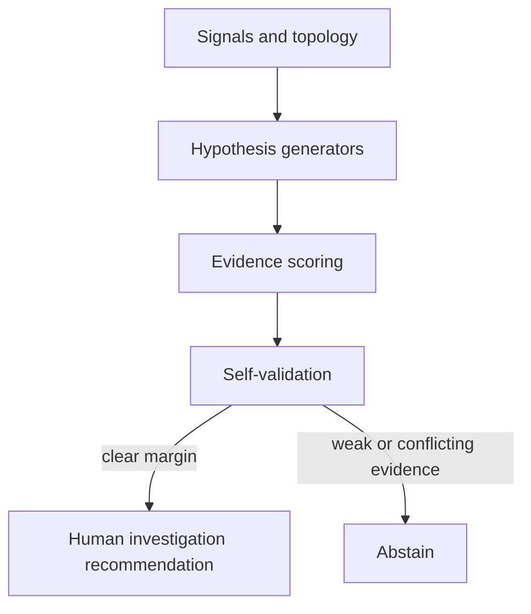

# Architecture

The reference app turns a synthetic incident into a ranked investigation record.
It treats topology, time, alarms, metrics, status, and changes as separate evidence
channels. Three deterministic hypothesis generators cover recent changes, shared
upstream dependencies, and resource or health signals.

Each hypothesis lists supporting and contradictory evidence, affected-node
coverage, and four checks: temporal order, blast-radius coverage, contradiction
handling, and counterfactual scope. A minimum confidence and separation margin
prevent a close ranking from being presented as a cause.

The app has no network connector and no remediation executor. Its product
boundary ends at a reviewable recommendation for a human operator.
